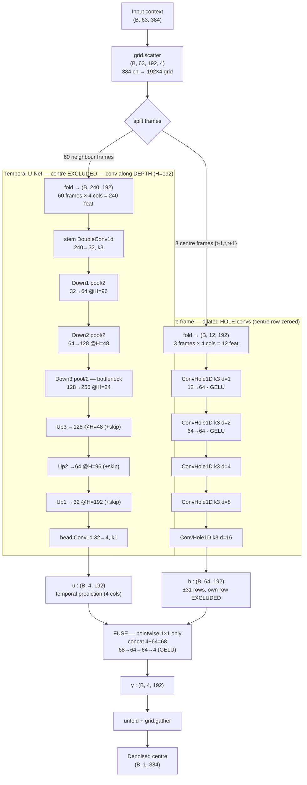

# Reference architecture — `base32` (`FoldDeepInterp1D`)

Blind-spot DeepInterpolation ephys denoiser, `geometry="fold"`. Predicts the clean
**center frame** `t` from a ±30-frame temporal window, never using the sample it
is predicting (temporal + probe-axis blind spot). **850,615 parameters.**

## Concrete config (Neuropixels 1.0)

| item | value |
|---|---|
| input | `(B, 63, 384)` = 63 frames × 384 channels |
| probe grid | `H=192` (depth) × `W=4` (columns), checkerboard, 50% filled → 384 contacts |
| temporal window | `pre=30`, `post=30`, `omission=1` → 60 neighbour frames |
| blind-spot frames | `bs_frames=3` → central `{t-1, t, t+1}` routed to the hole-conv branch |
| U-Net | `base_channels=32`, `depth=3` |
| blind-spot branch | `bs_channels=64`, `bs_depth=5` |
| fuse head | `fuse_channels=64`, `temporal_mult=1` |

## Data flow — plain-text view (renders anywhere)

```text
Input  (B, 63, 384)                      63 frames x 384 channels
  |
  v  grid.scatter  ->  (B, 63, 192, 4)   scatter 384 ch onto 192x4 checkerboard
  |
  +--------------------------------+--------------------------------+
  | 60 neighbour frames            | 3 centre frames {t-1, t, t+1}  |
  v  fold -> (B, 240, 192)         v  fold -> (B, 12, 192)          |
+-------------------------------+  +--------------------------------+
|  TEMPORAL U-NET               |  |  BLIND-SPOT BRANCH             |
|  (centre frame EXCLUDED)      |  |  (dilated hole-convs;          |
|  conv along DEPTH  H=192      |  |   centre row zeroed)           |
|                               |  |                                |
|  stem   240 -> 32    @H=192   |  |  hole k3 d=1    12 -> 64       |
|  Down1   32 -> 64    @H=96    |  |  hole k3 d=2    64 -> 64       |
|  Down2   64 -> 128   @H=48    |  |  hole k3 d=4    64 -> 64       |
|  Down3  128 -> 256   @H=24  <-bottleneck  hole k3 d=8   64 -> 64  |
|  Up3         -> 128  @H=48    |  |  hole k3 d=16   64 -> 64       |
|  Up2         -> 64   @H=96    |  |                                |
|  Up1         -> 32   @H=192   |  |  RF = +/-31 rows,              |
|  head    32 -> 4  (1x1)       |  |       own row EXCLUDED         |
+---------------+---------------+  +----------------+---------------+
                | u: (B, 4, 192)                    | b: (B, 64, 192)
                +------------------+----------------+
                                   v  concat -> (B, 68, 192)
                      +---------------------------------+
                      |  FUSE   (pointwise 1x1 only)    |
                      |  68 -> 64 -> 64 -> 4   (GELU)   |
                      +----------------+----------------+
                                       v  y: (B, 4, 192)
                              unfold  +  grid.gather
                                       v
                          Denoised centre  (B, 1, 384)
```

## Data flow — Mermaid view (needs a Mermaid-capable preview)



## Layer detail

### Temporal U-Net (`DeepInterpUNet1D`) — convolves along probe **depth** (length 192)
`DoubleConv1d` = `Conv1d(k3,pad1) → GroupNorm → GELU` ×2, with a `1×1` residual proj.

| stage | op | kernel | in→out ch | length H | ~params |
|---|---|---|---:|---:|---:|
| stem | DoubleConv1d | 3 | 240→32 | 192 | 34k |
| Down1 | MaxPool(2)+DoubleConv | 3 | 32→64 | 96 | 20k |
| Down2 | MaxPool(2)+DoubleConv | 3 | 64→128 | 48 | 82k |
| Down3 | MaxPool(2)+DoubleConv | 3 | 128→256 | 24 | 328k |
| Up3 | ConvTranspose(2)+DoubleConv | 3 | 256→128 | 48 | 213k |
| Up2 | ConvTranspose(2)+DoubleConv | 3 | 128→64 | 96 | 53k |
| Up1 | ConvTranspose(2)+DoubleConv | 3 | 64→32 | 192 | 13k |
| head | Conv1d | 1 | 32→4 | 192 | 0.1k |

> **~87% of all params live in the U-Net, and the bottleneck (Down3+Up3, 128↔256) alone is ~64%.** Scaling the U-Net (the `arch` experiment) grows exactly this — and it did nothing for d′.

### Blind-spot branch (`BlindSpotBranch1d`) — on the 3 centre frames
`ConvHole1D` = `Conv1d(k3)` with the **centre kernel tap forced to 0** → the output at a depth row never uses that row's own value. Dilations are powers of two so no stacked path can sum back to offset 0.

| layer | kernel | dilation | in→out | covers |
|---|---:|---:|---:|---|
| 1 | 3 | 1 | 12→64 | ±1 row |
| 2 | 3 | 2 | 64→64 | ±2 |
| 3 | 3 | 4 | 64→64 | ±4 |
| 4 | 3 | 8 | 64→64 | ±8 |
| 5 | 3 | 16 | 64→64 | ±16 |

Compounded RF = **±31 rows, own row excluded**. ~51k params.

### Fuse head — **pointwise `1×1` only** (this is what preserves the blind spot)
`Conv1d(68→64,1) → GELU → Conv1d(64→64,1) → GELU → Conv1d(64→4,1)`. ~9k params. No mixing across depth/width here, so it cannot reintroduce the target cell's own value.

## Receptive fields (the part worth studying)

| axis | extent | how |
|---|---|---|
| **temporal** | **full ±30-frame window at layer 1** | the 60 neighbour frames are **folded into the 240 input channels** — DI treats time as a *feature vector*, not a sequence. There is **no temporal convolution or pooling**; the stem already sees the whole window. |
| **depth (U-Net)** | **~68 rows at the bottleneck** (≈ ±34 rows; enc–dec a bit more) | 3× `MaxPool(2)` + double `k3` convs along H |
| **depth (blind-spot)** | **±31 rows, own row excluded** | 5 dilated hole-convs (1,2,4,8,16) |
| **width (4 cols)** | **full** | columns are folded into channels and mixed at the stem (240→32) and in the fuse |

## Why it's blind-spot-safe (three independent guards)
1. **Temporal:** the U-Net is fed only the neighbour frames (`omission=1` drops ±1 around `t`); it never sees frame `t`.
2. **Depth:** the hole-convs zero the centre tap and use powers-of-two dilations, so a row's own value can't leak — the branch sees only *other* rows.
3. **Fusion:** combining the two branches uses `1×1` convs only, which cannot mix a cell's own value back in.

Net effect: every output cell is a statistically unbiased prediction of the clean
centre frame that **never depends on that cell's own (noisy) input** — so training
against the noisy target can't collapse to the identity.

## Relevance to the amplitude discussion
The peak sample sits at the centre cell. The **temporal** path can't see it (blind),
so it must infer the peak from the ±window (features), and the **depth** blind-spot
path is explicitly forbidden from the target's own row — both reconstruct the peak
from *neighbours that are lower*, which is the structural source of the ~0.85
amplitude undershoot. The staged idea (spatial seed → temporal refine) would let the
**fuse/temporal stage start from the blind-safe spatial estimate `b` of the centre**,
rather than adding the two branches at the very end.
